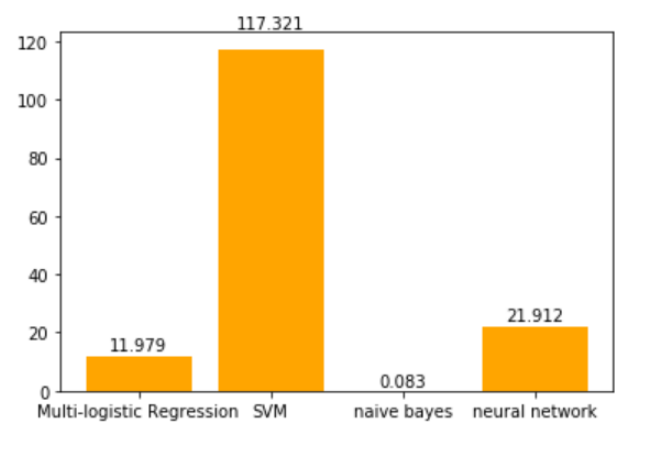

# Machine Learning Project -- News Classification

In this project, we used data set from [Online News Popularity Data Set](https://archive.ics.uci.edu/ml/datasets/Online+News+Popularity). 6500 pieces of news are fetched from [Mashable](http://mashable.com/) using python web-crawler and stored in Mongodb. Preprocessing was applied to this data set to get tf-idf features and get the vectorized data. Multiple models were applied, and the runing time and the accuracy for each model was recorded and compared to get conclusion.

## Data fetching using python web crawler
A web crawler based on python was used to fetch raw data. News is parsed from html file using beautifulSoup and regular expression. After that, news are stored in mongodb with url as id. 

[Python web crawler](./articleCrawler.py)

After that, labels were inserted into mongodb collection.

[Insert labels into mongodb](insert_labels.ipynb)

## Model training and test
In this process, data is preprocessed. Then different models including multi-logistic regression, SVM, Naive Bayes, and Neural Network were trained and tested.
[Machine Learning](ml_project.ipynb)

## Conclusion
Among multi-logistic regression, SVM, maive Bayes, and Neural Network. Naive Bayes has the shortest runing time which is  and Neural Network has the best accuracy with but with the longest running time.

The runing time of all method:

The accuracy:

